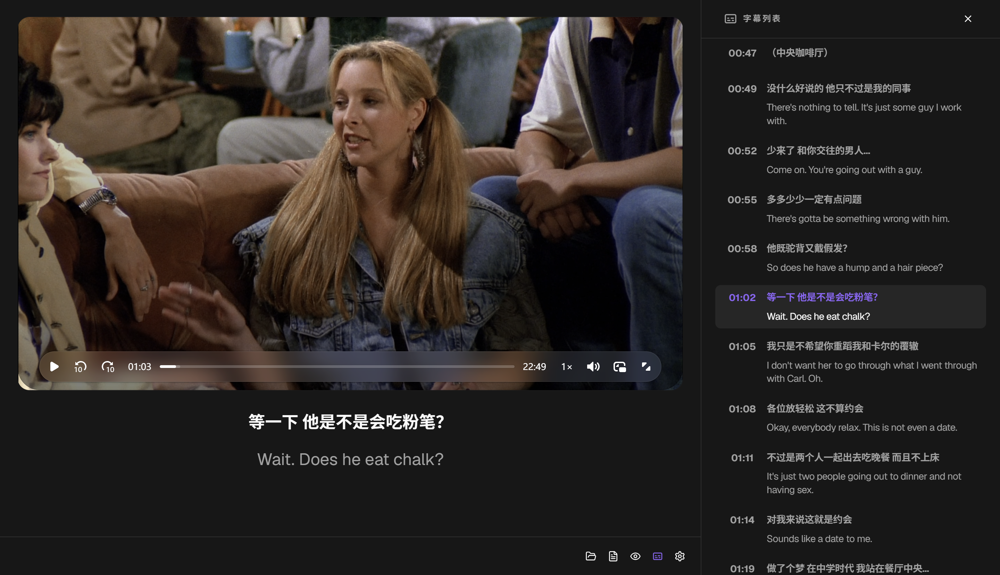

# Cadence Desktop

<div align="center">


**Immersive Bilingual Subtitle Video Learning Tool**

[](https://tauri.app)
[](https://react.dev)
[](https://typescriptlang.org)
[](LICENSE)

English | [简体中文](docs/README.zh.md)

</div>

---

### About

Cadence — rhythm and flow. A desktop video player designed specifically for **listening + subtitle learning**, precisely tailored for language learners.

### Features

- 🎬 **Subtitle Parsing** — Supports `.srt` / `.ass` formats with auto-format detection; parses bilingual subtitles (original + translation)
- 🔄 **Video-Subtitle Sync** — Highlights current caption during playback; click any caption timestamp in the sidebar to seek to that position
- 💾 **Subtitle Cache** — AI translation results are auto-cached via SHA-256 hash; reopening a file skips redundant processing
- 🤖 **AI-Powered Translation** — Integrated DeepSeek API automatically translates subtitles (Chinese ↔ English)
- 🔀 **Dual Subtitle Merge** — Merge two separate subtitle files (e.g., one per language) by timestamp alignment
- 📝 **Large Caption Display** — Dual-line bilingual display below the video player
- 🎭 **Blur Mode** — 4 levels: Off, Blur Top Line, Blur Bottom Line, Blur All; hover to temporarily reveal — perfect for self-testing
- 🔄 **Line Swap** — Toggle the order of source and translation lines
- 📋 **Subtitle Sidebar** — Scrollable full list with timestamp navigation; auto-scrolls to the current caption; resizable width (280–600px)
- 📖 **Word Dictionary** — Click any word in the subtitle to look up IPA pronunciation, part of speech, Chinese definitions, and example sentences powered by DeepSeek AI; results cached locally
- 🔁 **Single Sentence Loop** — Repeat-play the current subtitle sentence for focused listening practice; toggle with button or `L` key
- 🎭 **Subtitle Mask** — Draggable and resizable overlay to hide hard-burned subtitles on the video
- 🎵 **Audio Transcoding** — Auto-detect unsupported audio codecs (DTS, AC3, EAC3, FLAC, OPUS, etc.) and transcode to AAC 192kbps with progress bar
- ⚡ **Playback Speed** — 6 presets: 0.5×, 0.75×, 1×, 1.25×, 1.5×, 2×
- 🎮 **Gamepad Support** — Full controller input: play/pause, seek, volume, sidebar, mask, loop, speed, file open, settings
- 🔊 **Volume Control** — Vertical volume slider with mute toggle and on-screen volume display
- 🔄 **Auto-Update** — Built-in update checker with download progress and one-click install
- ⌨️ **Keyboard Shortcuts** — Play/pause, caption navigation, speed, volume, fullscreen, mute, loop, sidebar, blur mode, subtitle mask, line swap
- 📂 **Open Files** — Load local video and subtitle files via native file dialog; remembers last opened video
- 🎨 **Dark UI** — Immersive dark theme for focused learning
- 🌐 **i18n** — UI available in English and Chinese

### Prerequisites

**ffmpeg** (includes ffprobe) is required for audio transcoding and codec detection. Install it via your system package manager:

<details>
<summary><b>Windows</b></summary>

```powershell
# Option 1: winget (recommended)
winget install Gyan.FFmpeg

# Option 2: scoop
scoop install ffmpeg

# Option 3: choco
choco install ffmpeg
```

After installation, restart your terminal or add `ffmpeg` to your `PATH`.

</details>

<details>
<summary><b>macOS</b></summary>

```bash
brew install ffmpeg
```

</details>

<details>
<summary><b>Linux</b></summary>

```bash
# Debian / Ubuntu
sudo apt install ffmpeg

# Fedora
sudo dnf install ffmpeg

# Arch
sudo pacman -S ffmpeg
```

</details>

### Usage

1. **Open a Video** — Click the folder button on the toolbar, select a video file (`.mp4`, `.webm`, `.mkv`, `.avi`, `.mov`, `.flv`, `.wmv`)
2. **Load Subtitles** — Click the subtitle button, select `.srt` or `.ass` file
3. **AI Translation** — If the subtitle is monolingual, the app will prompt you to configure a DeepSeek API key for automatic translation
4. **Control Playback** — Use toolbar buttons, keyboard shortcuts, or gamepad
5. **Adjust Display** — Use the subtitle settings popover to toggle blur mode or swap line order
6. **Look Up Words** — Click any word in the subtitle area to see AI-powered definitions
7. **Hide Hard Subs** — Enable the subtitle mask to block hard-burned subtitles on the video

### Keyboard Shortcuts

#### Playback

| Key               | Action                   |
| ----------------- | ------------------------ |
| `Space`           | Play / Pause             |
| `←` / `→`         | Previous / Next caption  |
| `↑` / `↓`         | Volume Up / Down         |
| `,` / `<` / `.` / `>` | Slow Down / Speed Up |

#### Toggles

| Key | Action                    |
| --- | ------------------------- |
| `F` | Fullscreen                |
| `M` | Mute                      |
| `L` | Single Sentence Loop      |
| `S` | Sidebar                   |
| `B` | Blur Mode (cycle 4 levels) |
| `R` | Subtitle Mask             |
| `T` | Swap subtitle line order  |

> Letter shortcuts are disabled when focus is in an input field. Arrow keys and `Space` always work.

### Gamepad Mappings

| Button       | Action                  |
| ------------ | ----------------------- |
| A            | Play / Pause            |
| B            | Toggle Fullscreen       |
| X            | Toggle Subtitle Mask    |
| Y            | Toggle Sidebar          |
| LB           | Previous Caption        |
| RB           | Next Caption            |
| L3           | Cycle Playback Speed    |
| R3           | Toggle Sentence Loop    |
| Select/View  | Open Video File         |
| Start/Menu   | Open Settings           |
| D-pad Up     | Volume Up               |
| D-pad Down   | Volume Down             |
| D-pad Left   | Seek -5s                |
| D-pad Right  | Seek +5s                |

### Settings

| Setting          | Options                                        |
| ---------------- | ---------------------------------------------- |
| Theme            | System / Light / Dark                          |
| Language         | English / 中文                                 |
| Auto-transcode   | On / Off — auto-convert unsupported audio      |
| DeepSeek Model   | Fetch from API or enter custom model ID        |
| API Key          | DeepSeek API key (stored locally)              |
| Check for Update | View current version and check for new release |

### Preview

|           Light Mode            |              Dark Mode              |
| :-----------------------------: | :---------------------------------: |
|  |  |
