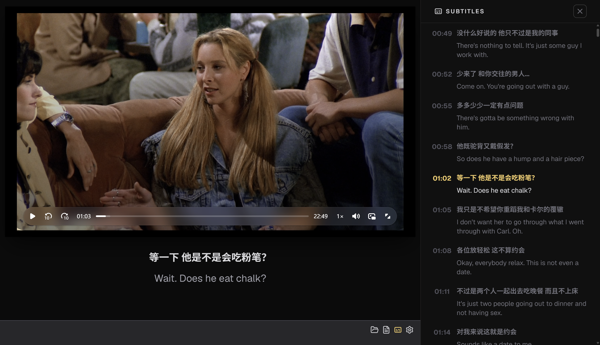

# Cadence Desktop

**Immersive Bilingual Subtitle Video Learning Tool**

[中文文档](docs/README-zh-CN.md)

---

### About

Cadence — rhythm and flow. A desktop video player designed specifically for **listening + subtitle learning**, precisely tailored for language learners.

### Features

- 🎬 **Subtitle Parsing** — Supports `.srt` / `.ass` formats, auto-detects bilingual subtitles (original + translation)
- 🔄 **Video-Subtitle Sync** — Highlights current caption during playback; click any caption timestamp to seek to that position
- ⌨️ **Global Shortcuts**
  - `Space` Pause / Play
  - `←` Previous caption
  - `→` Next caption
- 📂 **Open Files** — Load local video and subtitle files freely
- 🎨 **Dark UI** — Immersive dark theme for focused learning

### Preview

### Tech Stack

| Category | Tech |
|----------|------|
| Build | Vite + Bun |
| Desktop | Tauri v2 |
| UI | React 19 + React Router |
| Styling | Tailwind CSS v4 + Shadcn |
| Video | Video.js |
| State | Zustand |
| Icons | Lucide |
